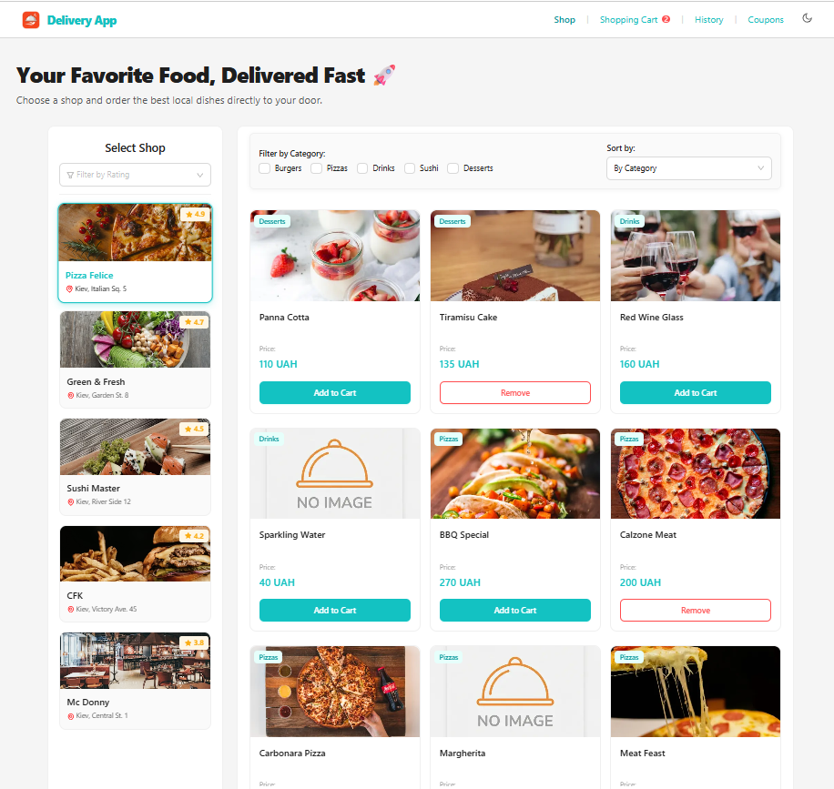
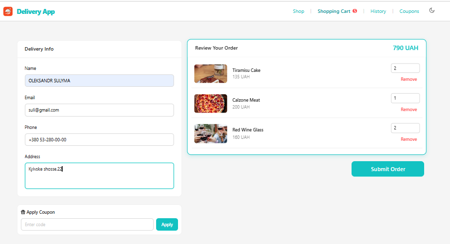
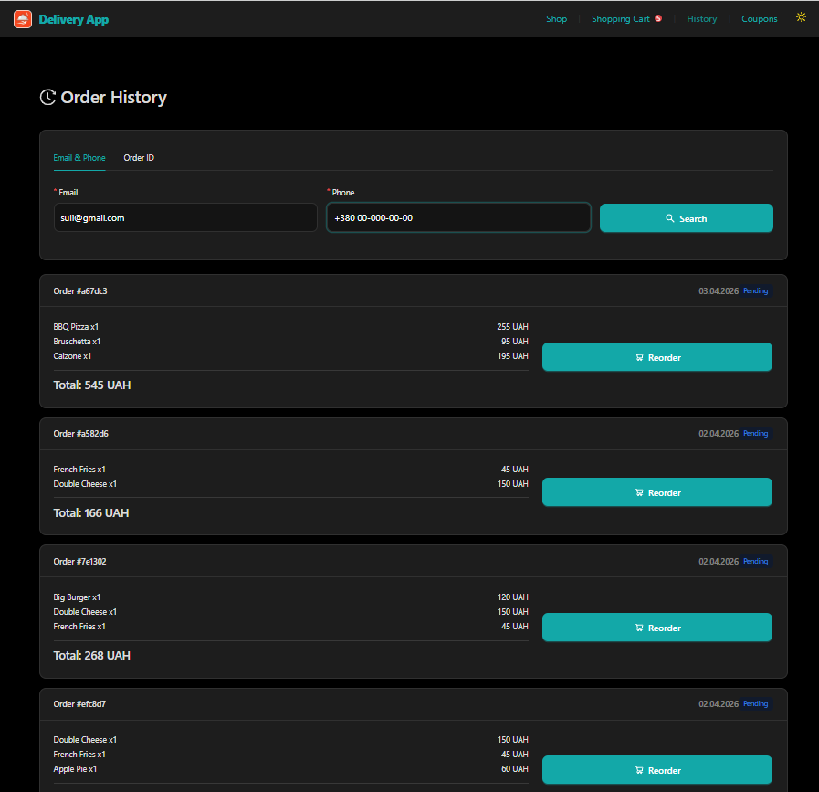

# Delivery App

Fullstack food delivery application with shop selection, product catalog, persistent shopping cart, checkout flow, order history, coupon validation, and single-use promo codes.

The project is organized as a monorepo with a Next.js frontend and an Express.js backend. The frontend handles the shopping experience, cart state, checkout UI, coupons page, and order history. The backend provides REST API endpoints for shops, products, orders, and coupons, with MongoDB used for persistent data storage.

## Live Demo

- Frontend: [https://delivery-app-frontend-two.vercel.app](https://delivery-app-frontend-two.vercel.app)
- Repository: [delivery-app](https://github.com/Oleksandr-Sulyma/delivery-app)

## Preview






## Features

- Shop list with rating-based sorting and rating filters
- Product catalog scoped by selected shop
- Product filtering by category
- Product sorting by price, name, category, and creation date
- Infinite loading for products
- Availability-aware product display
- Persistent cart state with Zustand and local storage
- Cart quantity updates and item removal
- One-shop cart rule with confirmation before replacing cart items
- Checkout form with name, email, phone, and address validation
- Ukrainian phone formatting with `+380` prefix
- Coupon list page with copy-to-clipboard
- Coupon validation before applying discount
- Percentage discounts applied to cart total
- Coupon deactivation after successful order placement
- Order history search by email and phone
- Order lookup by order ID
- Reorder flow from order history
- Light and dark theme state
- Toast notifications and modal confirmations
- Seed script for demo shops and products

## Tech Stack

### Frontend

- Next.js
- React
- TypeScript
- Ant Design
- Zustand
- Axios
- React Hot Toast
- React Intersection Observer
- Lucide React
- CSS Modules / global CSS
- Vercel

### Backend

- Node.js
- Express.js
- MongoDB
- Mongoose
- Celebrate / Joi
- CORS
- Helmet
- Pino HTTP
- Nodemon
- Render

## Project Structure

```text
delivery-app/
  backend/
    src/
      controllers/
      db/
      middleware/
      models/
      routes/
      validation/
      server.js
  frontend/
    app/
      cart/
      coupons/
      history/
    components/
    services/
    store/
    types/
  package.json
```

## Getting Started

### 1. Clone the repository

```bash
git clone https://github.com/Oleksandr-Sulyma/delivery-app.git
cd delivery-app
```

### 2. Install dependencies

Install root, frontend, and backend dependencies:

```bash
npm run install-all
```

Or install them manually:

```bash
npm install
npm install --prefix frontend
npm install --prefix backend
```

### 3. Configure environment variables

Create `.env` files in both `frontend` and `backend` folders.

Frontend:

```env
NEXT_PUBLIC_API_URL=http://localhost:3000
NEXT_PUBLIC_API_BASE_URL=http://localhost:3030
```

Backend:

```env
PORT=3030
MONGO_URL=your_mongodb_connection_string
FRONTEND_DOMAIN=http://localhost:3000
NODE_ENV=development
```

### 4. Seed demo data

Run the backend seed script to create demo shops and products:

```bash
npm run seed --prefix backend
```

### 5. Run the app

Run frontend and backend together from the repository root:

```bash
npm run dev
```

Or run them separately:

```bash
npm run dev-backend
npm run dev-frontend
```

Default local URLs:

- Frontend: [http://localhost:3000](http://localhost:3000)
- Backend: [http://localhost:3030](http://localhost:3030)

## Available Scripts

### Root

| Script | Description |
| --- | --- |
| `npm run dev` | Run frontend and backend concurrently |
| `npm run dev-frontend` | Run the frontend development server |
| `npm run dev-backend` | Run the backend development server |
| `npm run install-all` | Install dependencies for root, frontend, and backend |

### Frontend

| Script | Description |
| --- | --- |
| `npm run dev` | Start the Next.js development server |
| `npm run build` | Build the frontend for production |
| `npm start` | Start the production frontend server |
| `npm run lint` | Run ESLint |

### Backend

| Script | Description |
| --- | --- |
| `npm run dev` | Start backend with Nodemon |
| `npm start` | Start backend with Node.js |
| `npm run seed` | Seed demo shops and products |

## Environment Variables

### Frontend

| Variable | Description |
| --- | --- |
| `NEXT_PUBLIC_API_URL` | Frontend public URL |
| `NEXT_PUBLIC_API_BASE_URL` | Backend API base URL used by Axios |

### Backend

| Variable | Description |
| --- | --- |
| `PORT` | Backend server port |
| `MONGO_URL` | MongoDB connection string |
| `FRONTEND_DOMAIN` | Frontend URL allowed by CORS |
| `NODE_ENV` | Runtime environment |

## Application Routes

| Route | Description |
| --- | --- |
| `/` | Shop and product catalog |
| `/cart` | Cart review, coupon application, and checkout |
| `/coupons` | Active coupon list with copy-to-clipboard |
| `/history` | Order history search and reorder flow |

## API Overview

### Shops

| Method | Endpoint | Description |
| --- | --- | --- |
| `GET` | `/shops` | Get paginated shops |
| `GET` | `/shops/:shopId` | Get one shop by ID |
| `GET` | `/shops/:shopId/products` | Get products for one shop |

### Products

| Method | Endpoint | Description |
| --- | --- | --- |
| `GET` | `/products` | Get products by shop, category, availability, or IDs |
| `GET` | `/products/:id` | Get one product by ID |

### Orders

| Method | Endpoint | Description |
| --- | --- | --- |
| `POST` | `/orders` | Create a new order |
| `GET` | `/orders/history` | Get order history by email and phone |
| `GET` | `/orders/:id` | Get one order by ID |

### Coupons

| Method | Endpoint | Description |
| --- | --- | --- |
| `GET` | `/coupons` | Get active, non-expired coupons |
| `GET` | `/coupons/validate/:code` | Validate coupon code |
| `POST` | `/coupons` | Create coupon |

## Query Parameters

### `GET /shops`

| Parameter | Description |
| --- | --- |
| `page` | Page number |
| `perPage` | Items per page, up to 100 |
| `name` | Search shop by name |
| `minRating` | Minimum shop rating |
| `maxRating` | Maximum shop rating |
| `sortBy` | `rating`, `name`, or `createdAt` |
| `sortOrder` | `asc` or `desc` |

### `GET /products`

| Parameter | Description |
| --- | --- |
| `shopId` | Filter products by shop ID |
| `category` | Filter by one or more categories |
| `isAvailable` | Filter by availability |
| `ids` | Fetch specific product IDs |
| `page` | Page number |
| `perPage` | Items per page, up to 100 |
| `sortBy` | `price`, `name`, `category`, or `createdAt` |
| `sortOrder` | `asc` or `desc` |

Product categories:

```text
Burgers, Pizzas, Drinks, Sushi, Desserts
```

## Coupon Flow

1. The frontend loads active coupons from `GET /coupons`.
2. The user copies or enters a coupon code.
3. The frontend validates the code through `GET /coupons/validate/:code`.
4. The discount is applied to the cart total.
5. During order creation, the coupon code is sent to the backend.
6. After a successful order, the backend marks the coupon as inactive.
7. Expired coupons are removed automatically through a MongoDB TTL index.

## Data Models

### Shop

```js
{
  name: String,
  address: String,
  imageUrl: String,
  rating: Number
}
```

### Product

```js
{
  name: String,
  price: Number,
  imageUrl: String,
  category: String,
  shop: ObjectId,
  isAvailable: Boolean
}
```

### Order

```js
{
  user: {
    name: String,
    email: String,
    phone: String,
    address: String
  },
  items: [
    {
      product: ObjectId,
      name: String,
      quantity: Number,
      price: Number,
      imageUrl: String
    }
  ],
  totalPrice: Number,
  couponCode: String,
  status: String
}
```

### Coupon

```js
{
  name: String,
  code: String,
  discount: Number,
  imageUrl: String,
  isActive: Boolean,
  expiresAt: Date
}
```

## Architecture Notes

- The frontend keeps cart state in Zustand with local storage persistence.
- The app enforces a one-shop cart rule to avoid mixing products from different shops.
- The backend validates request params, queries, and bodies with Celebrate/Joi.
- Orders can be searched either by contact data or direct order ID.
- Reorder fetches fresh product data before adding items back to the cart.
- Coupons are active only when `isActive` is true and `expiresAt` is in the future.
- Product images are configured through `next.config.ts` remote image patterns.

## Author

Oleksandr Sulyma

- GitHub: [Oleksandr-Sulyma](https://github.com/Oleksandr-Sulyma)
- LinkedIn: [oleksandr-sulyma](https://www.linkedin.com/in/oleksandr-sulyma/)
